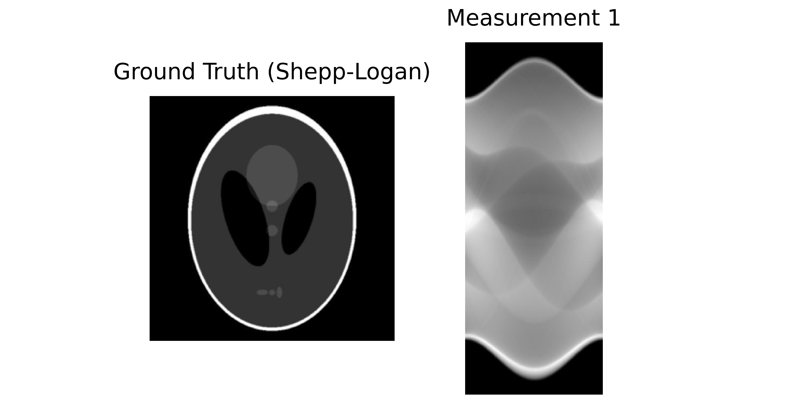

2D Tomography Reconstruction
==========================================================

This tutorial walks through a benchmark example using the **2D Tomography** dataset with the classic Shepp-Logan phantom. We will explore the dataset, configuration, and interpretation of results.

The Dataset: Shepp-Logan Phantom
-----------------------------------------

**What is it?**

The Shepp-Logan phantom is a standard test image created by Larry Shepp and Benjamin Logan. It serves as a model of a human head and is widely used to test image reconstruction algorithms in computed tomography (CT). The problem involves **recovering the 2D cross-section image from its projections (sinogram)** taken at different angles.

**Real-world analogy**: A medical CT scanner rotates around a patient, taking X-ray projections from many angles. The goal is to mathematically reconstruct the internal slice of the body from these projections.

**Dataset Preview**

**Left**: Ground truth (Shepp-Logan phantom). **Right**: Sinogram (measurements).

Configuration: Experiment Setup
-------------------------------

**Benchmark Purpose**

This experiment tests the **scalability of reconstruction algorithms** on high-resolution 2D images (2048×2048). Such high resolutions are common in modern specialized imaging but pose memory challenges. We compare single-GPU execution against a distributed multi-GPU approach.

We use the configuration file ``configs/tomography_2d.yml`` to set up the experiment.

Execution Grid
~~~~~~~~~~~~~~

The execution grid compares a single-GPU baseline with a distributed 2-GPU configuration:

.. code-block:: yaml

   slurm_gres, slurm_ntasks_per_node, slurm_nodes, distribute_physics, distribute_denoiser, patch_size, overlap, max_batch_size: [
     ["gpu:1", 1, 1, false, false, 0, 0, 0],
     ["gpu:2", 2, 1, true, true, 448, 32, 0],
     ["gpu:4", 4, 1, true, true, 448, 32, 0],
     ]

**Important**: To ensure proper distributed parallelization, the number of tasks per node (``slurm_ntasks_per_node``) must equal the number of GPUs (``slurm_gres``). This ensures one process per GPU.

This creates a grid comparing three configurations:

**Configuration 1: Single GPU (baseline)**

.. code-block:: yaml

   ["gpu:1", 1, 1, false, false, 0, 0, 0]

- ``slurm_gres: gpu:1`` = 1 GPU
- ``slurm_ntasks_per_node: 1`` = 1 process per GPU
- ``distribute_physics: false`` = No parallelization of blur operators
- ``distribute_denoiser: false`` = Full image processed at once
- **Purpose**: Baseline performance on limited resources

**Configuration 2: 2-GPU with Distribution**

.. code-block:: yaml

   ["gpu:2", 2, 1, true, true, 448, 32, 0]

- ``slurm_gres: gpu:2`` = 2 GPUs
- ``slurm_ntasks_per_node: 2`` = 2 processes (one per GPU)
- ``distribute_physics: true`` = **Split 8 blur operators across 2 GPUs** (4 each)
- ``distribute_denoiser: true`` = **Spatial tiling**: Split large image into patches
- ``patch_size: 448`` = Each patch is 448×448 pixels
- ``overlap: 32`` = Overlap region for smooth transitions between patches
- **Purpose**: Multi-GPU scalability with operator and spatial distribution

**Configuration 3: 4-GPU with Increased Distribution**

.. code-block:: yaml

   ["gpu:4", 4, 1, true, true, 448, 32, 0]

- Similar to Config 2, but with 4 GPUs.
- **Purpose**: Further scalability test with more GPU resources

For more details on distributed computing, see the `DeepInv distributed documentation <https://deepinv.github.io/deepinv/user_guide/reconstruction/distributed.html>`_.

Dataset Parameters
~~~~~~~~~~~~~~~~~~~

.. code-block:: yaml

   dataset:
     - tomography_2d:
         img_size: 2048
         num_operators: 8
         num_angles: 100
         noise_level: 0.01

- ``img_size: 2048``: A high resolution for standard testing.
- ``num_operators: 8``: Number of tomography operators (angle splits).
- ``num_angles: 100``: Total number of projection angles.
- ``noise_level: 0.01``: Additive Gaussian noise level.

Solver 
~~~~~~

We use a Plug-and-Play (PnP) solver with a DRUNet denoiser:

.. code-block:: yaml

   solver:
     - PnP:
         denoiser: drunet
         denoiser_sigma: 0.01
         init_method: ["zeros"]

**Solver Parameters:**

- ``denoiser``: The pretrained denoiser to use as a prior. 

- ``denoiser_sigma``: Noise level hint passed to the denoiser. Helps the denoiser adapt to the noise level.

- ``init_method``: How to initialize the reconstruction. 

Interpreting Results
--------------------

**Benchmark Results**

Below is an interactive dashboard comparing the configurations:

.. raw:: html

   <iframe src="../_static/images/tomography_2d/dashboard.html" width="100%" height="800px" style="border: none; border-radius: 5px;"></iframe>

Interpretation
~~~~~~~~~~~~~~
**PSNR vs. Iteration & PSNR vs. Computation Time**

All setups reach about the same final PSNR, so using multiple GPUs does not reduce reconstruction quality. The multi-GPU runs reach the target PSNR much faster than the single-GPU baseline, which shows the speedup clearly.

**Time Breakdown: Gradient and Denoiser**

The denoiser dominates runtime and is the main bottleneck. Adding more GPUs reduces denoiser time, but gradient time slightly increases since the gradient step is cheap, and communication between GPUs often takes longer than the computation itself.

