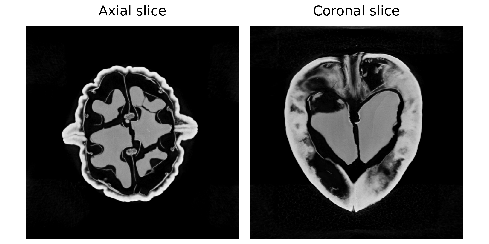

3D Cone-Beam CT Reconstruction
==========================================================

This tutorial explores a challenging 3D inverse problem using the **Walnut** dataset. Reconstructing 3D volumes is computationally intensive and memory-demanding, making it a prime candidate for distributed solving.

The Dataset: Walnut Cone-Beam CT
-----------------------------------------

**What is it?**

The dataset consists of X-ray Computed Tomography (CT) data of a walnut, using **cone-beam geometry**. A point X-ray source emits a conical beam that passes through the object and is recorded on a 2D detector, producing projection images from multiple viewpoints. The task is to reconstruct the full 3D volumetric structure of the walnut from these 2D projections. The underlying volume is derived from a real CT scan, with cone-beam measurements generated using a physically realistic forward model.

**Real-world analogy**: Similar to medical CT scanners or airport baggage scanners, where a dense object with complex internal structure is reconstructed in 3D from multiple X-ray projections.

**Dataset Preview**

**Left**: Axial slice (horizontal view from above) **Right**: Coronal slice (vertical view from front).

Configuration: Experiment Setup
-------------------------------

**Benchmark Purpose**

The primary challenge in 3D CT is **GPU memory management**. A 3D volume and the associated denoiser network operations can easily exceed the memory of a single GPU.

This experiment focuses on **optimizing distributed parameters** on a multi-GPU setup. Specifically, we investigate how the ``max_batch_size`` parameter affects performance and memory usage when running on 2 GPUs. 

We use the configuration file ``configs/tomography_3d.yml``.

Execution Grid
~~~~~~~~~~~~~~

All runs use 2 GPUs but vary the batch size used during the distributed denoising step:

.. code-block:: yaml

   slurm_gres, slurm_ntasks_per_node, distribute_physics, distribute_denoiser, patch_size, overlap, max_batch_size, denoiser_sigma, denoiser_lambda_relaxation: [
     ["gpu:2", 2, true, true, [8,256,256], [2,16,16], 10, 0.03, 10.0],
     ["gpu:2", 2, true, true, [8,256,256], [2,16,16], 8, 0.03, 10.0],
     ["gpu:2", 2, true, true, [8,256,256], [2,16,16], 4, 0.03, 10.0],
     ["gpu:2", 2, true, true, [8,256,256], [2,16,16], 2, 0.03, 10.0],
   ]

- ``slurm_gres: gpu:2``: All configurations use 2 GPUs.
- ``distribute_physics: true``: Projections are split across GPUs.
- ``distribute_denoiser: true``: The 3D volume is split into chunks (patches).
- ``patch_size: [8,256,256]``: The size of 3D patches processed by the denoiser.
- ``max_batch_size``: Controls how many patches are processed in parallel on each GPU. **Values Tested: 10, 8, 4, 2**.

**Why vary batch size?**

Processing more patches at once can sometimes speed up computation, but it also increases memory usage, and a batch that’s too large may cause an Out-Of-Memory (OOM) error.

Dataset Parameters
~~~~~~~~~~~~~~~~~~~

.. code-block:: yaml

   dataset:
     - tomography_3d:
         num_operators: 2
         num_projections: 50
         geometry_type: conebeam
         use_dataset_sinogram: true

- ``num_operators: 2``: Number of tomography operators (angle splits).
- ``num_projections: 50``: Number of projection angles to use.
- ``geometry_type: conebeam``: Projection geometry for ASTRA.

Solver 
~~~~~~

We use PnP with a 3D-capable DRUNet denoiser, initialized with a Pseudo-Inverse method:

.. code-block:: yaml

   solver:
     - PnP:
         denoiser: drunet
         init_method: ["pseudo_inverse"]

Interpreting Results
--------------------

**Benchmark Results**

Below is an interactive dashboard comparing the configurations:

.. raw:: html

   <iframe src="../_static/images/tomography_3d/dashboard.html" width="100%" height="800px" style="border: none; border-radius: 5px;"></iframe>

Interpretation
~~~~~~~~~~~~~~

**Batch Size vs. Memory**

Peak GPU memory grows with ``max_batch_size``, so smaller batches are needed when memory is limited to prevent OOM errors.

**Batch Size vs. Time**
 
Larger batch sizes are usually thought to speed up denoising by making better use of GPU parallelism, but that doesn’t always happen. The effect depends on the denoiser model, image size, and chosen batch size. For more details, see the :doc:`takeaways page <../takeaways/gpu_memory_time_analysis>`.

